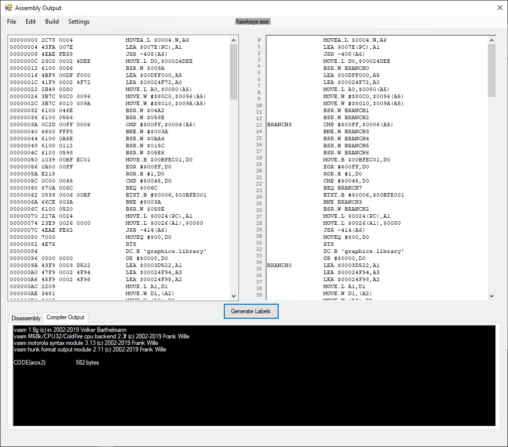

# Amiga Binary To Assembly Conversion Tool

After spending lots of hours of pain trying to get some of my old Amiga 500 intros working again, I decided there must be a better way ...
 This application was written as a quick hack to convert Amiga binaries into editable source code on a PC.
  Please note that this software is not **100%** complete & is still work in progress.
 My approach is definitely not the best way to reverse engineer `Amiga` software.
 It has helped me and works for my purposes of converting my old intros into source code again.
 This software hasn't been tested on any other applications other than my own.

### Usage
When the Amiga bytes have been loaded by the application, the result will be displayed in the `Left Window`.
 To make the code editable and add branch and jump labels, click on the `Generate Labels` button.
 The resulting editable code will be displayed in the right window of the application..
 Right clicking in the in the `Left Window` will open a context menu that allows you to convert selected lines to either `DC.B's` or `DC.W's`. This can be useful to convert `Copper lists` or `Text` to something more meaningful.
 To test the validity of the de-compiled code, clicking `Compile` from the main menu `Build` => `Compile` will compile the code with `VASM`.
 
 

