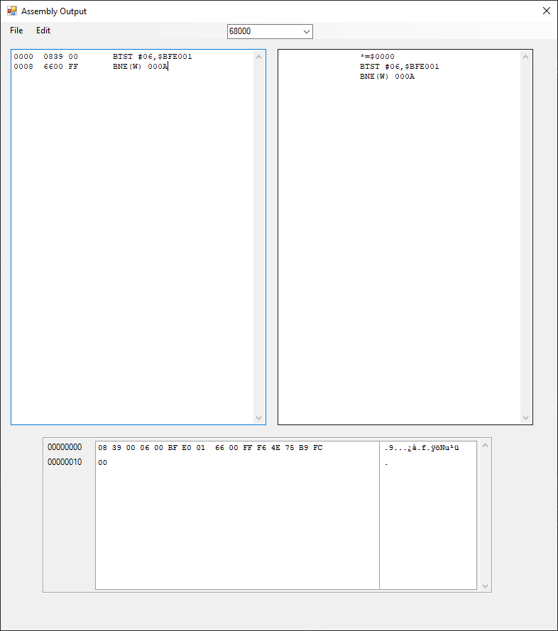

# Amiga Binary To Assembly Conversion Tool

This application was written as a quick way to convert Amiga binaries into editable source code.
Decompiled code can be tested by clicking Compile as VBCC interaction has been included.

